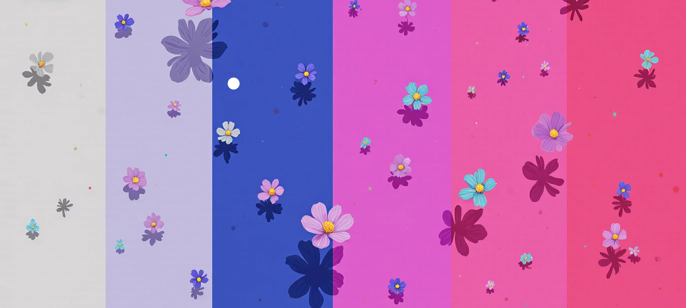

# 🌸 My Daily - Diário Pessoal Digital 🌸

Projeto de diário digital pessoal desenvolvido para fins educativos e criativos. A proposta é oferecer um espaço simples, bonito e funcional onde o(a) usuário(a) pode registrar seus pensamentos, sentimentos e reflexões do dia.

Um diário digital minimalista e responsivo para registrar seus pensamentos e memórias do dia a dia, desenvolvido com HTML, CSS e Bootstrap.

## ✨ Recursos

- 📅 Registro de entradas diárias com data
- 📝 Área para escrever sobre seu dia
- 🗂️ Visualização do histórico de anotações
- 🌈 Design limpo e agradável
- 📱 Totalmente responsivo para todos os dispositivos
- 🎨 Paleta de cores suaves e harmoniosas

## 🛠️ Tecnologias Utilizadas

- 
- 
- 
- 
